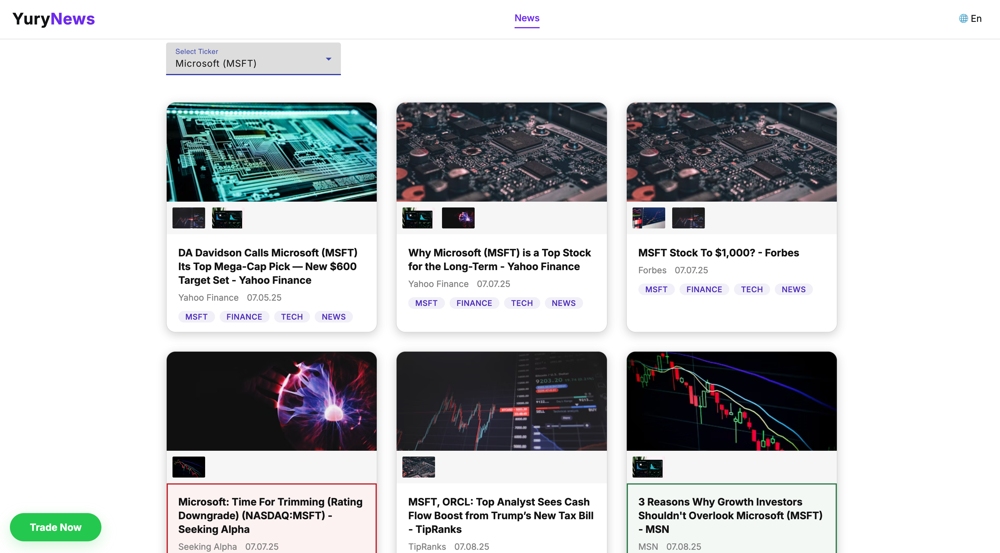

# YuryNews



YuryNews is a modern financial news application that provides up-to-date news for various financial instruments including cryptocurrencies and tech stocks. The application fetches news from Google News and categorizes them based on content analysis.

## Features

- **Ticker Selection**: Choose from a variety of financial instruments including:
  - Cryptocurrencies (BTC, ETH)
  - Tech Stocks (AAPL, MSFT, GOOGL, AMZN)
- **Real-time News**: Fetch the latest news from Google News RSS feed
- **Content Categorization**: Automatically categorize news as finance, crypto, tech, bullish, or bearish based on content analysis
- **Image Generation**: Automatically generate relevant images for news items based on their categories
- **Image Gallery**: View multiple images per news item with image swapping functionality
- **Responsive Design**: Optimized for both desktop and mobile devices
- **Fallback Mechanism**: Use mock data if the API call fails

## Technologies Used

- **Angular 17**: Modern web framework for building the application
- **Angular Material**: UI component library for a consistent look and feel
- **RxJS**: Reactive programming library for handling asynchronous operations
- **TypeScript**: Typed superset of JavaScript for better code quality
- **Google News RSS**: Source of news data
- **CORS Proxy**: Used to access the RSS feed from the browser

## Project Structure

- **src/app/components**: Contains the UI components
  - **news**: Main component for displaying news items
  - **ticker-selector**: Component for selecting financial instruments
- **src/app/services**: Contains the services
  - **news.service.ts**: Handles fetching news from the API
  - **image.service.ts**: Generates images based on news content
  - **category.service.ts**: Categorizes news based on content analysis
- **src/app/models**: Contains data models
  - **news-item.model.ts**: Defines the structure of news items

## Installation

1. Clone the repository:
   ```bash
   git clone https://github.com/yuriyzotov/NewsYury.git
   cd NewsYury
   ```

2. Install dependencies:
   ```bash
   npm install
   ```

3. Start the development server:
   ```bash
   npm start
   ```

4. Open your browser and navigate to `http://localhost:4200`

## Usage

1. Select a ticker from the dropdown menu (default is BTC)
2. View the latest news for the selected ticker
3. Click on a news item to read the full article
4. Click on thumbnail images to swap them with the main image
5. Notice the color-coding for bullish (green) and bearish (red) news items

## Building for Production

To build the application for production, run:
```bash
npm run build
```

For building the application specifically for GitHub Pages, use:
```bash
npm run build:github
```

This will set the correct base href for GitHub Pages deployment.

The build artifacts will be stored in the `docs/` directory.

## Prebuilt Application

A prebuilt version of the application is available in the `docs/` folder. This version can be used directly from GitHub Pages without requiring a server. To use the prebuilt application:

1. Navigate to the GitHub repository: https://github.com/yuriyzotov/NewsYury
2. Go to Settings > Pages
3. Under "Source", select "Deploy from a branch"
4. Under "Branch", select "main" and "/docs" folder
5. Click "Save"

The application will be available at `https://yuriyzotov.github.io/NewsYury/`.

## Contributing

Contributions are welcome! Please feel free to submit a Pull Request.

## Author

This project is maintained by [Yury Zotov](https://github.com/yuriyzotov).

## License

This project is licensed under the MIT License - see the LICENSE file for details.
